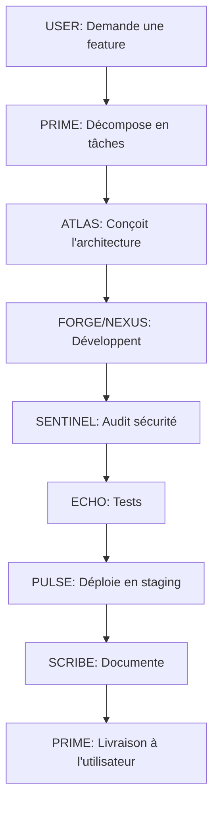

# Multi-Agent Orchestration Workflow

Install skill packs from SkillHub and configure specialized Hermes profiles with Kanban integration.

## Orchestration Multi-Agents avec TRINITY

### **1. Introduction à TRINITY**
TRINITY est un **Fast Coordinator** pour l'orchestration multi-agents dans Hermes. Il utilise une **head linéaire entraînée par sep-CMA-ES** pour router les tâches vers les agents appropriés en fonction du **hidden state** du modèle.

- **Meta-Router** : Classifie les tâches en *simple*, *complexe*, ou *stratégique* via `qwen2.5-0.5b-instruct`.
- **TRINITY (Fast Coordinator)** : Routage rapide pour les tâches simples (70% des cas).
- **RL Conductor** : Génère des workflows pour les tâches complexes (25% des cas).
- **PRIME** : Superviseur stratégique (5% des cas).

### **2. Configuration de TRINITY**
#### **2.1. Prérequis**
- **Modèles disponibles** : Adapter en fonction des contraintes régionales (ex : Gabon).
  - Meta-Router et TRINITY : `qwen2.5-0.5b-instruct` (Cloudflare Workers AI).
  - Agents spécialisés : `llama-3.1-8b-instruct` (Cloudflare Workers AI).
  - PRIME : `claude-sonnet-4` (AWS Bedrock).

- **Dépendances** : Installer les packages nécessaires.
  ```bash
  cd ~/.hermes/orchestration/trinity
  uv pip install torch transformers cma numpy sentence-transformers scikit-learn
  ```

#### **2.2. Structure des Fichiers**
```bash
~/.hermes/orchestration/
├── trinity/
│   ├── config.yaml          # Configuration de TRINITY
│   ├── agent_pool.yaml      # Pool des 14 agents
│   ├── router.py            # Routage basé sur le hidden state
│   ├── train.py             # Entraînement sep-CMA-ES
│   └── checkpoints/         # Modèles entraînés
├── meta_router/
│   ├── config.yaml          # Configuration du Meta-Router
│   └── meta_router.py       # Classification des tâches
└── config.yaml              # Intégration dans Hermes
```

#### **2.3. Configurer `agent_pool.yaml`**
Définir les **14 agents** avec leurs capacités, modèles et coûts.

Exemple :
```yaml
- id: "atlas"
  name: "ATLAS"
  capabilities: ["architecture", "design"]
  model: "claude-sonnet-4"
  cost_per_call: 0.02
  available: true
```

#### **2.4. Configurer `config.yaml` pour TRINITY**
```yaml
model:
  provider: cloudflare
  model_name: qwen2.5-0.5b-instruct
  temperature: 0.1
  hidden_state_layer: -1  # Dernière couche du modèle

head:
  input_dim: 3584  # Dimension du hidden state de Qwen2.5-0.5B
  output_dim: 14   # Nombre d'agents dans le pool
  learning_rate: 0.01

training:
  method: sep-cma-es  # Optimisation évolutionnaire
  population_size: 20
  max_iterations: 1000
  checkpoint_dir: ~/.hermes/orchestration/trinity/checkpoints
```

### **3. Entraînement de TRINITY**
#### **3.1. Lancer l'entraînement**
```bash
cd ~/.hermes/orchestration/trinity
python train.py
```
- **Durée** : ~1-2h sur CPU (ou 20-30min sur GPU).
- **Résultat** : Le modèle entraîné est sauvegardé dans `checkpoints/trinity_head_best.pt`.

#### **3.2. Tester le Routage**
```bash
python router.py
```
**Exemple de sortie attendue** :
```
Agent sélectionné: FORGE (confiance: 0.87)
```

### **4. Configuration du Meta-Router**
#### **4.1. Configurer `config.yaml` pour le Meta-Router**
```yaml
model:
  provider: cloudflare
  model_name: qwen2.5-0.5b-instruct
  temperature: 0.1

classification_rules:
  simple_keywords: ["fix", "add", "create", "update", "delete", "format", "test", "debug"]
  complex_keywords: ["design", "architect", "plan", "compare", "optimize", "implement", "workflow"]
  strategic_keywords: ["strategy", "roadmap", "decision", "trade-off", "vision", "supervise"]

output:
  simple: "trinity"
  complex: "conductor"
  strategic: "prime"
```

#### **4.2. Tester le Meta-Router**
```bash
cd ~/.hermes/orchestration/meta_router
python meta_router.py
```
**Exemple de sortie attendue** :
```
Routeur sélectionné: trinity
```

### **5. Intégration dans Hermes**
#### **5.1. Mettre à jour `~/.hermes/orchestration/config.yaml`**
```yaml
orchestration:
  enabled: true
  mode: "hybrid"  # "learned", "defined", "hybrid"
  meta_router:
    config_path: "~/.hermes/orchestration/meta_router/config.yaml"
  trinity:
    enabled: true
    checkpoint: "~/.hermes/orchestration/trinity/checkpoints/trinity_head_best.pt"
    agent_pool: "~/.hermes/orchestration/trinity/agent_pool.yaml"
    device: "cpu"
  conductor:
    enabled: false  # À activer après entraînement
    checkpoint: "~/.hermes/orchestration/conductor/checkpoints/"
    device: "cpu"
```

#### **5.2. Mettre à jour `SOUL.md` pour PRIME**
Ajouter cette section à `~/.hermes/profiles/prime/SOUL.md` :

```markdown
## Orchestration Apprise
- **Meta-Router** : Classifie les tâches en *Simple/Complexe/Stratégique* via `qwen2.5-0.5b-instruct`.
- **Fast Coordinator (TRINITY)** : Routage rapide pour les tâches simples (70% des cas) via une head linéaire entraînée par sep-CMA-ES.
- **RL Conductor** : Génère des workflows pour les tâches complexes (25% des cas) via `llama-3.1-8b-instruct` (désactivé par défaut).
- **PRIME** : Superviseur stratégique (5% des cas) via `claude-sonnet-4`.

**Flux** :
1. Meta-Router → Trinity/Conductor/PRIME.
2. Le coordinateur génère un workflow.
3. PRIME valide/modifie le workflow.
4. Exécution par les agents.
5. Feedback enregistré dans `~/.hermes/orchestration/data/traces.jsonl` pour amélioration continue.
```

### **6. Automatisation avec les Crons**
#### **6.1. Configurer `~/.hermes/crons.yaml`**
```yaml
crons:
  - name: "trinity-training"
    schedule: "0 4 * * 1"  # Lundi à 4h
    agent: trinity
    command: "cd ~/.hermes/orchestration/trinity && python train.py --epochs 100"
    enabled: true

  - name: "trinity-routing-test"
    schedule: "0 3 * * *"  # Tous les jours à 3h
    agent: trinity
    command: "cd ~/.hermes/orchestration/trinity && python router.py --test"
    enabled: true
```

#### **6.2. Synchroniser les Crons**
```bash
hermes cron sync
```

### Step 2 — Install skills

Install each found slug:

```bash
skillhub install <slug> --dir ~/.hermes/skills/ 2>&1 | tail -1
```

**Pitfall:** Installing in a shell loop (e.g. `for s in ...; do skillhub install ...`) may trigger Hermes' background-process detector if the command uses `&` or pipes that look like backgrounding. Install one at a time or use a simple sequential loop without `&`.

**Pitfall:** Timeouts — some skills take 10-20s to install. Set timeout >= 60s per call.

### Step 3 — Create a specialized profile

```bash
hermes profile create <profile-name> --clone --description "<description>"
```

This clones default config, .env, SOUL.md, and skills.

### Step 4 — Symlink the new skills into the profile

```bash
for s in <slug1> <slug2> ...; do
  ln -s ~/.hermes/skills/$s ~/.hermes/profiles/<profile-name>/skills/$s 2>/dev/null && echo "✓ $s" || echo "✗ $s"
done
```

The symlinks keep a single source of truth in `~/.hermes/skills/` while each profile gets its own isolated skill set.

### Step 4b — Enable Kanban dispatch (one-time setup)

If not already set, enable automatic dispatch so Kanban routes tasks to the right agent:

  kanban.dispatch_in_gateway: true

Use `hermes config set kanban.dispatch_in_gateway true` or edit `~/.hermes/config.yaml` directly.

### Step 5 — Verify Kanban registration

```bash
hermes kanban assignees
```

Profiles created via `hermes profile create --clone` auto-register with Kanban. If missing, the profile directory doesn't have the right structure.

### Step 6 — Add trigger keywords for auto-loading

Add FR/EN trigger keywords to the main skill(s) so the agent auto-loads them:

```yaml
metadata:
  hermes:
    triggers:
      - keyword en francais
      - english keyword
```

Patch the SKILL.md frontmatter:

```bash
# Use the patch tool to add triggers after the description line
# in ~/.hermes/skills/<name>/SKILL.md
```

### Step 7 — Update session context (mandatory)

- Update memory entry for agents count: `memory(action='replace', target='memory', old_text='N agents', content='M agents ...')`. Do NOT add a new memory row — always replace the existing one, or memory fills up (2200 char cap).

The memory line should look like:
`Multi-agents Kanban : N agents (agent-a, agent-b, ...). dispatch_in_gateway=true, board init. Profiles skills symlinkes.`

- Add entry to daily bilan file at `~/.hermes/daily-bilan/<YYYY-MM-DD>.md` with a clear section heading and bullet list of installed skills

### Step 8 — Configure MCP servers (when needed)

Some skill packs (e.g. office-word, hyperbrowser) require an MCP server, not just skills. See [MCP Server Setup Patterns](references/mcp-server-setup.md) for the four transport types (pipx, npx, docker, URL).

Key MCP learnings from this session:
- **office-word-mcp-server**: Pure Python (python-docx), NO office suite needed. pipx install + `word_mcp_server` command.
- **hyperbrowser**: npx-based browser automation (scrape, extract, crawl). Needs `HYPERBROWSER_API_KEY` in .env.
- **github-mcp-server**: Docker-based, already pre-configured in Hermes as `github`.

New MCP servers appear in `hermes mcp list` immediately but tools are only available on next session start (or manual reload).
- Add entry to daily bilan file at `~/.hermes/daily-bilan/<YYYY-MM-DD>.md`

## Pitfalls

**SkillHub package URLs don't resolve as install slugs.** A URL like `https://skillhub.cn/skillspackage/marketing-social-media-operation` contains multiple skills. You must derive the individual slugs from search results. See [SkillHub Search Patterns](references/skillhub-search-patterns.md) for effective keyword strategies.

**Frontmatter corruption** — Some skills from SkillHub use non-standard YAML (e.g., `metadata: {"clawdbot":...}` inline JSON). When patching triggers, the old `---` close may remain, creating a double separator. After patching, verify the file header with `head -40` and fix orphaned `---` lines. Common fix:

1. Read the SKILL.md — look for orphaned metadata lines (author, homepage, source, tags, version) after the second `---`
2. If found, use `patch` to delete the orphaned block between the real frontmatter end and the markdown body
3. The healthiest approach: merge orphaned metadata into the frontmatter section (keep author/source/version if useful)

**Trigger keywords must be in the frontmatter** — They go under `metadata.hermes.triggers:` in the YAML frontmatter. Placing them after closing `---` makes them invisible to Hermes' loader. Verify with `head -5 SKILL.md` that triggers are between the first `---` pair.

**Shell encoding** — The system uses `GBK` encoding. For Python scripts displaying French text, set `PYTHONIOENCODING=utf-8`.

**Memory full** — When adding new agent counts to memory, the store may be full (2200 char limit). Consolidate by removing stale entries first, then adding the update in one batch call. Use `memory(action='add', ...)` only when there's room; otherwise use the `operations` array to remove + add in one call.

## Documentation des Workflows

### **Création de `WORKFLOWS.md`**
Chaque projet doit avoir un **`WORKFLOWS.md`** pour standardiser les processus.

#### **Structure Standard d'un `WORKFLOWS.md`**
```markdown
# WORKFLOWS.md

# 🚀 Workflows Standards pour <NOM_PROJET>

Ce document décrit les **workflows génériques** pour lancer et gérer un projet avec l'architecture Hermes.

---

## **1. Comment Lancer un Nouveau Projet ?**
### **📌 Étapes Clés**
1. Définir le scope avec `PRIME`.
2. Créer les sous-agents nécessaires.
3. Configurer les dépendances dans le Kanban Hermes.
4. Lancer les tâches avec `hermes kanban run <task_id>`.
5. Automatiser les workflows avec des crons.

### **🔧 Commandes Utiles**
```bash
# Créer un sous-agent
hermes kanban add "Développer le backend" --assignee nexus --model aws/bedrock/sonnet-4 --skills api-dev,cloudbase

# Lister les tâches
hermes kanban list

# Lancer une tâche
hermes kanban run t_terre_back

# Voir les logs
hermes kanban logs t_terre_back
```

---

## **2. Workflow : Nouvelle Feature**
### **📌 Processus**


---

## **3. Bonnes Pratiques**
### **✅ Do's**
- Utiliser les sous-agents pour spécialiser les tâches.
- Automatiser les workflows répétitifs avec des crons.
- Documenter chaque décision dans `KEEPER`.
- Tester systématiquement avec `ECHO`.

### **❌ Don'ts**
- Ne pas bypasser `SENTINEL` pour les déploiements.
- Ne pas ignorer les alertes des crons.
- Ne pas travailler en silo : toujours synchroniser avec `PRIME`.
```

## Formation des Agents

### **Création des `SOUL.md`**
Chaque agent doit avoir un **`SOUL.md`** dans son profil (`~/.hermes/profiles/<agent>/SOUL.md`) pour définir sa mission, ses responsabilités, et ses règles.

#### **Structure Standard d'un `SOUL.md`**
```markdown
# SOUL.md — <NOM_AGENT>

## 🎯 Mission
<Texte clair décrivant le rôle de l'agent.>

## 🔍 Responsabilités
1. **Tâche 1** : Description.
2. **Tâche 2** : Description.
3. **Tâche 3** : Description.

## 🛠️ Outils Autorisés
- `outil1` : Description.
- `outil2` : Description.

## ⚠️ Règles Strictes
- Règle 1.
- Règle 2.

## 📌 Exemple de Tâche
```markdown
**Prompt** : "<Exemple de demande>"

**Étapes** :
1. Étape 1.
2. Étape 2.
3. Étape 3.

**Livrable** : <Description du livrable.>
```
```

## Automatisation des Workflows

### **Configuration des Crons**
Les tâches récurrentes (veille, sécurité, coûts, tests) doivent être automatisées avec des **crons Hermes**.

#### **Exemple de Configuration (`~/.hermes/crons.yaml`)**
```yaml
crons:
  # Veille concurrentielle hebdomadaire
  - name: "weekly-competitive-intel"
    schedule: "0 9 * * 1"  # Lundi à 9h
    agent: scout
    prompt: |
      Effectue une veille concurrentielle sur les librairies en ligne en Afrique francophone.
      Cible : 5 concurrents directs (ex : Amazon, Jumia Livres, Afrilivres).
      Livrables :
        - Tableau comparatif (prix, catalogue, livraison).
        - Tendances marché (ex : croissance du ebook).
        - Opportunités pour Terre & Chaleur.
      Outils : web_search, web_extract.
    deliver: "telegram"

  # Audit de sécurité quotidien
  - name: "daily-security-scan"
    schedule: "0 6 * * *"  # Tous les jours à 6h
    agent: sentinel
    prompt: |
      Effectue un audit de sécurité sur tous les repos actifs de MWANAITECH.
      Cible : Terre & Chaleur, Jarvis, et tout autre projet en cours.
      Livrables :
        - Rapport des vulnérabilités (CVEs, secrets exposés).
        - PRs de correction si nécessaire.
      Outils : terminal (trivy, semgrep), mcp.
    deliver: "telegram"

  # Optimisation des coûts mensuelle
  - name: "monthly-cost-optimization"
    schedule: "0 10 1 * *"  # 1er du mois à 10h
    agent: oracle
    prompt: |
      Analyse les coûts mensuels de MWANAITECH (AWS, Vercel, Neon, etc.).
      Livrables :
        - Tableau des dépenses par service.
        - Recommandations d'optimisation (ex : downscaling, réservations).
        - Alertes pour les anomalies.
      Outils : terminal (aws cost explorer), mcp.
    deliver: "telegram"
```

#### **Commandes Utiles**
```bash
# Créer un cron
hermes cron create --name "weekly-competitive-intel" --schedule "0 9 * * 1" --agent scout --prompt "Effectue une veille concurrentielle..."

# Lister les crons
hermes cron list

# Voir les logs d'un cron
hermes cron logs <job_id>
```

## Documentation des Workflows

### **Création de `WORKFLOWS.md`**

### **Steps to Configure Sub-Agents for a Project**

#### **1. Define Roles and Tasks**
Create tasks for each role in the project:
- **Frontend Developer**: Develop UI with Next.js, integrate design system.
- **Backend Developer**: Set up database (Neon + Drizzle), API routes.
- **Payment Engineer**: Integrate eBilling (Mobile Money).
- **UI/UX Designer**: Create design system (Figma, motifs, typography).
- **AI Engineer**: Integrate Vercel AI SDK (covers, summaries, chatbot).

#### **2. Assign Models and Skills**
| Role                | Model                     | Skills                                                                 |
|---------------------|---------------------------|------------------------------------------------------------------------|
| Frontend Developer  | `cloudflare/llama-3.1-8b` | `frontend-ui-engineering`, `web-development`, `prototype-design`      |
| Backend Developer   | `aws/bedrock/sonnet-4`    | `api-dev`, `cloudbase`, `code-refactoring`                            |
| Payment Engineer    | `aws/bedrock/sonnet-4`    | `api-dev`, `security-best-practices`, `tencent-cloud-expert`          |
| UI/UX Designer      | `cloudflare/llama-3.1-8b` | `brand-cog`, `design-ui-prototype-expert-pack`, `ls-gm-img`            |
| AI Engineer         | `aws/bedrock/sonnet-4`    | `mlops`, `vercel-ai-generate-text`, `autonomous-ai-agents`             |

#### **3. Set Up Dependencies**
- Frontend depends on **Backend** and **Design**.
- Payment depends on **Backend**.
- AI depends on **Backend** and **Frontend**.

#### **4. Create Tasks in Kanban**
```bash
# Example: Create tasks for a full-stack project
hermes kanban create "Develop Frontend (Next.js + PWA)" --assignee frontend-developer --skills frontend-ui-engineering,web-development --model cloudflare/llama-3.1-8b-instruct
hermes kanban create "Develop Backend (Neon + Drizzle)" --assignee backend-developer --skills api-dev,cloudbase --model aws/bedrock/sonnet-4
hermes kanban create "Integrate Payment (eBilling)" --assignee payment-engineer --skills api-dev,security-best-practices --model aws/bedrock/sonnet-4
hermes kanban create "Create Design System (Figma + Motifs)" --assignee ui-ux-designer --skills brand-cog,design-ui-prototype-expert-pack --model cloudflare/llama-3.1-8b-instruct
hermes kanban create "Integrate Vercel AI SDK (Covers/Summaries)" --assignee ai-engineer --skills mlops,vercel-ai-generate-text --model aws/bedrock/sonnet-4
```

#### **5. Link Tasks**
```bash
hermes kanban link <backend_task_id> <frontend_task_id>
hermes kanban link <design_task_id> <frontend_task_id>
hermes kanban link <backend_task_id> <payment_task_id>
hermes kanban link <backend_task_id> <ai_task_id>
hermes kanban link <frontend_task_id> <ai_task_id>
```

#### **6. Run Tasks**
```bash
hermes kanban run <design_task_id>
hermes kanban run <backend_task_id>
hermes kanban run <payment_task_id>
hermes kanban run <frontend_task_id>
hermes kanban run <ai_task_id>
```

#### **7. Monitor Progress**
```bash
# List all tasks
hermes kanban list

# Check logs for a specific task
hermes kanban logs <task_id>
```

---

## Error Handling

### **Payload Too Large (413)**
If a task fails with a **413 (Payload Too Large)** error:
1. **Use local scripts** to avoid Hermes' payload limits.
2. **Split the task** into smaller steps (e.g., generate a document in parts).
3. **Use lighter models** (e.g., Cloudflare Workers AI instead of AWS Bedrock).

### **Fallback for Providers**
If a provider (e.g., AWS Bedrock) is unavailable:
1. **Fallback to Cloudflare Workers AI** or another provider.
2. **Update the task** to use the fallback model:
   ```bash
   hermes kanban update <task_id> --model cloudflare/llama-3.1-8b-instruct
   ```
