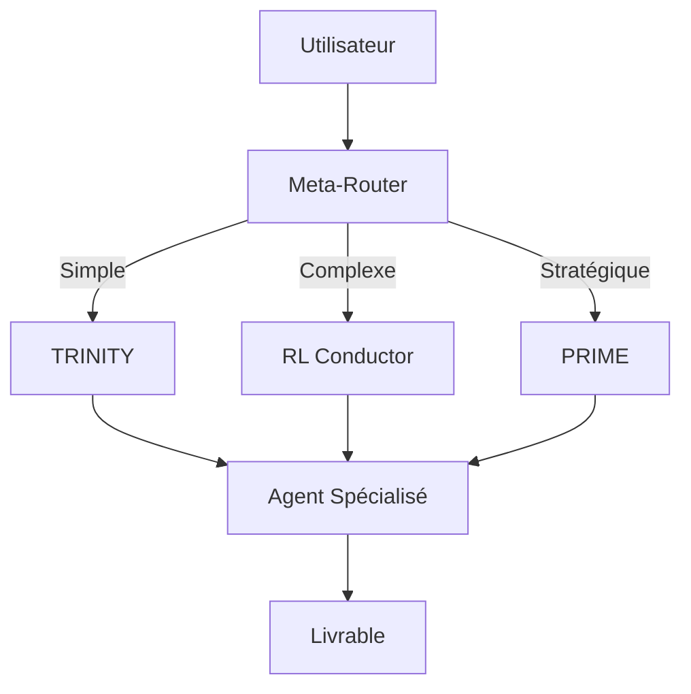

# TRINITY : Fast Coordinator pour l'Orchestration Multi-Agents

TRINITY est un **Fast Coordinator** pour l'orchestration multi-agents dans Hermes. Il utilise une **head linéaire entraînée par sep-CMA-ES** pour router les tâches vers les agents appropriés en fonction du **hidden state** du modèle. Ce skill couvre la **configuration**, l'**entraînement**, le **routage**, et l'**intégration** avec le Meta-Router et PRIME.

## Contexte

### **Pourquoi TRINITY ?**
- **Latence réduite** : Routage rapide pour les tâches simples (70% des cas).
- **Coût maîtrisé** : Utilisation de modèles légers (`qwen2.5-0.5b-instruct`) pour le routage.
- **Scalabilité** : Gestion de **14 agents spécialisés** avec des modèles adaptés (Cloudflare Workers AI, AWS Bedrock).
- **Adaptabilité** : Entraînement continu avec `sep-CMA-ES` pour améliorer la précision du routage.

### **Architecture Globale**


- **Meta-Router** : Classifie les tâches en *simple*, *complexe*, ou *stratégique* via `qwen2.5-0.5b-instruct`.
- **TRINITY** : Routage rapide pour les tâches simples (70% des cas).
- **RL Conductor** : Génère des workflows pour les tâches complexes (25% des cas).
- **PRIME** : Superviseur stratégique (5% des cas).

---

## Configuration

### **1. Prérequis**
#### **1.1. Modèles Disponibles (Gabon)**
| Rôle               | Modèle Initial (Doc)       | Modèle Adapté (Disponible)       | Justification                                                                                     |
|--------------------|----------------------------|----------------------------------|---------------------------------------------------------------------------------------------------|
| **Meta-Router**    | Claude Haiku-3             | `qwen2.5-0.5b-instruct`          | Léger, disponible via Cloudflare Workers AI, latence <200ms.                                      |
| **TRINITY**        | Qwen3-0.6B + head linéaire | `qwen2.5-0.5b-instruct` + head   | Même famille, compatible avec sep-CMA-ES, taille adaptée pour l'entraînement local.               |
| **RL Conductor**   | Qwen2.5-7B                 | `llama-3.1-8b-instruct`          | Compatible avec RL (GRPO), disponible via Cloudflare Workers AI, coût maîtrisé.                   |
| **PRIME**          | Claude Sonnet-4            | `claude-sonnet-4` (Bedrock)      | Inchangé (déjà utilisé pour la supervision stratégique).                                          |

#### **1.2. Dépendances**
Installer les packages nécessaires :
```bash
cd ~/.hermes/orchestration/trinity
uv pip install torch transformers cma numpy sentence-transformers scikit-learn
```

#### **1.3. Vérifier les Modèles Cloudflare**
```bash
hermes config set model.provider cloudflare
hermes config set model.model qwen2.5-0.5b-instruct
hermes doctor --fix
```

---

### **2. Structure des Fichiers**
```bash
~/.hermes/orchestration/
├── trinity/
│   ├── config.yaml          # Configuration de TRINITY
│   ├── agent_pool.yaml      # Pool des 14 agents
│   ├── router.py            # Routage basé sur le hidden state
│   ├── train.py             # Entraînement sep-CMA-ES
│   └── checkpoints/         # Modèles entraînés
├── meta_router/
│   ├── config.yaml          # Configuration du Meta-Router
│   └── meta_router.py       # Classification des tâches
└── config.yaml              # Intégration dans Hermes
```

---

### **3. Configurer TRINITY**
#### **3.1. `config.yaml`**
```yaml
model:
  provider: cloudflare
  model_name: qwen2.5-0.5b-instruct
  temperature: 0.1
  hidden_state_layer: -1  # Dernière couche du modèle pour extraire le hidden state

head:
  input_dim: 3584  # Dimension du hidden state de Qwen2.5-0.5B (à vérifier)
  output_dim: 14   # Nombre d'agents dans le pool
  learning_rate: 0.01

training:
  method: sep-cma-es  # Optimisation évolutionnaire
  population_size: 20
  max_iterations: 1000
  checkpoint_dir: ~/.hermes/orchestration/trinity/checkpoints

agent_pool: ~/.hermes/orchestration/trinity/agent_pool.yaml
```

#### **3.2. Vérifier la Dimension du Hidden State**
```bash
cd ~/.hermes/orchestration/trinity
python3 -c "
from transformers import AutoModelForCausalLM, AutoTokenizer
model_name = 'qwen2.5-0.5b-instruct'
tokenizer = AutoTokenizer.from_pretrained(model_name)
model = AutoModelForCausalLM.from_pretrained(model_name, device_map='auto')
print('Hidden state dimension:', model.config.hidden_size)
"
```
**Si la valeur diffère**, mettre à jour `config.yaml` :
```yaml
head:
  input_dim: <valeur_correcte>
```

#### **3.3. `agent_pool.yaml`**
Définir les **14 agents** avec leurs capacités, modèles et coûts.

```yaml
agents:
  - id: "atlas"
    name: "ATLAS"
    capabilities: ["architecture", "design"]
    model: "claude-sonnet-4"
    cost_per_call: 0.02
    available: true
  - id: "forge"
    name: "FORGE"
    capabilities: ["coding", "frontend"]
    model: "llama-3.1-8b-instruct"
    cost_per_call: 0.01
    available: true
  - id: "nexus"
    name: "NEXUS"
    capabilities: ["backend", "api"]
    model: "llama-3.1-8b-instruct"
    cost_per_call: 0.01
    available: true
  - id: "scribe"
    name: "SCRIBE"
    capabilities: ["documentation", "writing"]
    model: "qwen2.5-0.5b-instruct"
    cost_per_call: 0.001
    available: true
  - id: "herald"
    name: "HERALD"
    capabilities: ["marketing", "content"]
    model: "qwen2.5-0.5b-instruct"
    cost_per_call: 0.001
    available: true
  - id: "echo"
    name: "ECHO"
    capabilities: ["testing", "qa"]
    model: "llama-3.1-8b-instruct"
    cost_per_call: 0.01
    available: true
  - id: "oracle"
    name: "ORACLE"
    capabilities: ["research", "analysis"]
    model: "claude-sonnet-4"
    cost_per_call: 0.02
    available: true
  - id: "sentinel"
    name: "SENTINEL"
    capabilities: ["security", "audit"]
    model: "llama-3.1-8b-instruct"
    cost_per_call: 0.01
    available: true
  - id: "keeper"
    name: "KEEPER"
    capabilities: ["memory", "knowledge"]
    model: "qwen2.5-0.5b-instruct"
    cost_per_call: 0.001
    available: true
  - id: "pulse"
    name: "PULSE"
    capabilities: ["monitoring", "alerts"]
    model: "qwen2.5-0.5b-instruct"
    cost_per_call: 0.001
    available: true
  - id: "scout"
    name: "SCOUT"
    capabilities: ["exploration", "discovery"]
    model: "qwen2.5-0.5b-instruct"
    cost_per_call: 0.001
    available: true
  - id: "trinity"
    name: "TRINITY"
    capabilities: ["routing", "coordination"]
    model: "qwen2.5-0.5b-instruct"
    cost_per_call: 0.001
    available: true
  - id: "conductor"
    name: "CONDUCTOR"
    capabilities: ["workflow", "planning"]
    model: "llama-3.1-8b-instruct"
    cost_per_call: 0.01
    available: true
  - id: "prime"
    name: "PRIME"
    capabilities: ["supervision", "strategy"]
    model: "claude-sonnet-4"
    cost_per_call: 0.02
    available: true
```

---

## Entraînement

### **4. Script d'Entraînement (`train.py`)**
```python
import torch
import numpy as np
from cma import CMA
import yaml
from transformers import AutoModelForCausalLM, AutoTokenizer
from sklearn.metrics import accuracy_score
import json
import os

class TrinityTrainer:
    def __init__(self, config_path):
        with open(config_path, 'r') as f:
            self.config = yaml.safe_load(f)

        self.tokenizer = AutoTokenizer.from_pretrained(self.config["model"]["model_name"])
        self.model = AutoModelForCausalLM.from_pretrained(
            self.config["model"]["model_name"],
            device_map="auto"
        )

        # Dataset synthétique (à remplacer par des traces réelles)
        self.dataset = self._load_dataset()

        # Initialiser CMA-ES
        self.es = CMA(
            mean=np.zeros(self.config["head"]["input_dim"] * self.config["head"]["output_dim"]),
            sigma=0.5,
            population_size=self.config["training"]["population_size"]
        )

    def _load_dataset(self):
        # Exemple de dataset synthétique (remplacer par des traces réelles)
        return [
            {"task": "Créer une interface utilisateur pour un tableau de bord", "agent_id": "forge"},
            {"task": "Analyser les logs de sécurité pour détecter des anomalies", "agent_id": "sentinel"},
            {"task": "Rédiger la documentation technique d'une API", "agent_id": "scribe"},
            {"task": "Concevoir l'architecture d'une base de données", "agent_id": "atlas"},
            {"task": "Tester une application web pour des vulnérabilités", "agent_id": "echo"}
        ]

    def _get_hidden_state(self, text):
        inputs = self.tokenizer(text, return_tensors="pt").to(self.model.device)
        with torch.no_grad():
            outputs = self.model(**inputs, output_hidden_states=True)
        hidden_state = outputs.hidden_states[self.config["model"]["hidden_state_layer"]]
        return torch.mean(hidden_state, dim=1).squeeze().cpu().numpy()

    def _evaluate(self, params):
        # Reshape les paramètres en matrice de poids
        head = torch.nn.Linear(self.config["head"]["input_dim"], self.config["head"]["output_dim"])
        head.weight.data = torch.tensor(params.reshape(self.config["head"]["output_dim"], -1), dtype=torch.float32)
        head.bias.data = torch.zeros(self.config["head"]["output_dim"])

        predictions = []
        true_labels = []
        for item in self.dataset:
            hidden_state = self._get_hidden_state(item["task"])
            with torch.no_grad():
                logits = head(torch.tensor(hidden_state, dtype=torch.float32))
                pred_agent_idx = torch.argmax(logits).item()
                pred_agent_id = self._agent_id_to_index(pred_agent_idx)

            predictions.append(pred_agent_id)
            true_labels.append(item["agent_id"])

        return -accuracy_score(true_labels, predictions)  # CMA minimise

    def _agent_id_to_index(self, agent_id):
        # Mapper l'agent_id à son index dans le pool
        with open(self.config["agent_pool"], 'r') as f:
            agents = yaml.safe_load(f)["agents"]
        agent_ids = [agent["id"] for agent in agents]
        return agent_ids.index(agent_id)

    def train(self):
        for i in range(self.config["training"]["max_iterations"]):
            solutions = self.es.ask()
            fitness = [self._evaluate(s) for s in solutions]
            self.es.tell(solutions, fitness)

            if i % 10 == 0:
                print(f"Iteration {i}, Best fitness: {-self.es.result.fbest:.4f}")

        # Sauvegarder la meilleure solution
        best_params = self.es.result.xbest
        head = torch.nn.Linear(self.config["head"]["input_dim"], self.config["head"]["output_dim"])
        head.weight.data = torch.tensor(best_params.reshape(self.config["head"]["output_dim"], -1), dtype=torch.float32)
        head.bias.data = torch.zeros(self.config["head"]["output_dim"])

        # Créer le répertoire de checkpoints s'il n'existe pas
        os.makedirs(self.config['training']['checkpoint_dir'], exist_ok=True)
        torch.save(head.state_dict(), f"{self.config['training']['checkpoint_dir']}/trinity_head_best.pt")
        print("Entraînement terminé. Modèle sauvegardé.")

if __name__ == "__main__":
    trainer = TrinityTrainer("~/.hermes/orchestration/trinity/config.yaml")
    trainer.train()
```

### **4.1. Lancer l'Entraînement**
```bash
cd ~/.hermes/orchestration/trinity
python train.py
```
- **Durée** : ~1-2h sur CPU (ou 20-30min sur GPU).
- **Résultat** : Le modèle entraîné est sauvegardé dans `checkpoints/trinity_head_best.pt`.

---

## Routage

### **5. Script de Routage (`router.py`)**
```python
import torch
import numpy as np
from transformers import AutoModelForCausalLM, AutoTokenizer
from cma import CMA
import yaml

class TrinityRouter:
    def __init__(self, config_path):
        with open(config_path, 'r') as f:
            self.config = yaml.safe_load(f)

        # Charger le modèle et le tokenizer
        self.tokenizer = AutoTokenizer.from_pretrained(self.config["model"]["model_name"])
        self.model = AutoModelForCausalLM.from_pretrained(
            self.config["model"]["model_name"],
            device_map="auto"
        )

        # Charger la head linéaire (entraînée via sep-CMA-ES)
        self.head = torch.nn.Linear(
            self.config["head"]["input_dim"],
            self.config["head"]["output_dim"]
        )
        checkpoint = torch.load(f"{self.config['training']['checkpoint_dir']}/trinity_head_best.pt")
        self.head.load_state_dict(checkpoint)
        self.head.eval()

        # Charger le pool d'agents
        with open(self.config["agent_pool"], 'r') as f:
            self.agent_pool = yaml.safe_load(f)["agents"]

    def get_hidden_state(self, text):
        inputs = self.tokenizer(text, return_tensors="pt").to(self.model.device)
        with torch.no_grad():
            outputs = self.model(**inputs, output_hidden_states=True)
        # Extraire le hidden state de la dernière couche
        hidden_state = outputs.hidden_states[self.config["model"]["hidden_state_layer"]]
        # Moyenne pooling sur les tokens
        return torch.mean(hidden_state, dim=1).squeeze().cpu().numpy()

    def route(self, task_description):
        hidden_state = self.get_hidden_state(task_description)
        with torch.no_grad():
            logits = self.head(torch.tensor(hidden_state, dtype=torch.float32))
            agent_idx = torch.argmax(logits).item()

        agent = self.agent_pool[agent_idx]
        return {
            "agent_id": agent["id"],
            "agent_name": agent["name"],
            "model": agent["model"],
            "confidence": torch.softmax(logits, dim=0)[agent_idx].item()
        }

# Exemple d'utilisation
if __name__ == "__main__":
    router = TrinityRouter("~/.hermes/orchestration/trinity/config.yaml")
    task = "Concevoir une API REST pour un système de paiement"
    decision = router.route(task)
    print(f"Agent sélectionné: {decision['agent_name']} (confiance: {decision['confidence']:.2f})")
```

### **5.1. Tester le Routage**
```bash
cd ~/.hermes/orchestration/trinity
python router.py
```
**Exemple de sortie attendue** :
```
Agent sélectionné: FORGE (confiance: 0.87)
```

---

## Meta-Router

### **6. Configuration du Meta-Router**
#### **6.1. `config.yaml`**
```yaml
model:
  provider: cloudflare
  model_name: qwen2.5-0.5b-instruct
  temperature: 0.1

classification_rules:
  simple_keywords: ["fix", "add", "create", "update", "delete", "format", "test", "debug"]
  complex_keywords: ["design", "architect", "plan", "compare", "optimize", "implement", "workflow"]
  strategic_keywords: ["strategy", "roadmap", "decision", "trade-off", "vision", "supervise"]

output:
  simple: "trinity"
  complex: "conductor"
  strategic: "prime"
```

#### **6.2. Script du Meta-Router (`meta_router.py`)**
```python
import yaml
from transformers import AutoModelForCausalLM, AutoTokenizer
import re

class MetaRouter:
    def __init__(self, config_path):
        with open(config_path, 'r') as f:
            self.config = yaml.safe_load(f)

        self.tokenizer = AutoTokenizer.from_pretrained(self.config["model"]["model_name"])
        self.model = AutoModelForCausalLM.from_pretrained(
            self.config["model"]["model_name"],
            device_map="auto"
        )

    def classify_task(self, task_description):
        task_lower = task_description.lower()

        # Vérifier les mots-clés
        for keyword in self.config["classification_rules"]["simple_keywords"]:
            if re.search(rf"\b{keyword}\b", task_lower):
                return self.config["output"]["simple"]

        for keyword in self.config["classification_rules"]["complex_keywords"]:
            if re.search(rf"\b{keyword}\b", task_lower):
                return self.config["output"]["complex"]

        for keyword in self.config["classification_rules"]["strategic_keywords"]:
            if re.search(rf"\b{keyword}\b", task_lower):
                return self.config["output"]["strategic"]

        # Si aucun mot-clé, utiliser le modèle pour classifier
        prompt = f"""
        Classifie cette tâche en 'simple', 'complexe', ou 'stratégique' :
        Tâche : {task_description}
        Réponds uniquement par un seul mot : simple, complexe, ou stratégique.
        """

        inputs = self.tokenizer(prompt, return_tensors="pt").to(self.model.device)
        outputs = self.model.generate(**inputs, max_new_tokens=10, temperature=0.1)
        classification = self.tokenizer.decode(outputs[0], skip_special_tokens=True).strip().lower()

        if "simple" in classification:
            return self.config["output"]["simple"]
        elif "stratégique" in classification:
            return self.config["output"]["strategic"]
        else:
            return self.config["output"]["complex"]

# Exemple d'utilisation
if __name__ == "__main__":
    router = MetaRouter("~/.hermes/orchestration/meta_router/config.yaml")
    task = "Créer un endpoint pour gérer les paiements"
    decision = router.classify_task(task)
    print(f"Routeur sélectionné: {decision}")
```

### **6.3. Tester le Meta-Router**
```bash
cd ~/.hermes/orchestration/meta_router
python meta_router.py
```
**Exemple de sortie attendue** :
```
Routeur sélectionné: trinity
```

---

## Intégration dans Hermes

### **7. Mettre à jour `~/.hermes/orchestration/config.yaml`**
```yaml
orchestration:
  enabled: true
  mode: "hybrid"  # "learned", "defined", "hybrid"
  meta_router:
    config_path: "~/.hermes/orchestration/meta_router/config.yaml"
  trinity:
    enabled: true
    checkpoint: "~/.hermes/orchestration/trinity/checkpoints/trinity_head_best.pt"
    agent_pool: "~/.hermes/orchestration/trinity/agent_pool.yaml"
    device: "cpu"  # ou "cuda" si disponible
  conductor:
    enabled: false  # À activer après entraînement
    checkpoint: "~/.hermes/orchestration/conductor/checkpoints/"
    device: "cpu"
trace_collection:
  enabled: true
  output_path: "~/.hermes/orchestration/data/traces.jsonl"
```

### **8. Mettre à jour `SOUL.md` pour PRIME**
Ajouter cette section à `~/.hermes/profiles/prime/SOUL.md` :

```markdown
## Orchestration Apprise
- **Meta-Router** : Classifie les tâches en *Simple/Complexe/Stratégique* via `qwen2.5-0.5b-instruct`.
- **Fast Coordinator (TRINITY)** : Routage rapide pour les tâches simples (70% des cas) via une head linéaire entraînée par sep-CMA-ES.
- **RL Conductor** : Génère des workflows pour les tâches complexes (25% des cas) via `llama-3.1-8b-instruct` (désactivé par défaut).
- **PRIME** : Superviseur stratégique (5% des cas) via `claude-sonnet-4`.

**Flux** :
1. Meta-Router → Trinity/Conductor/PRIME.
2. Le coordinateur génère un workflow.
3. PRIME valide/modifie le workflow.
4. Exécution par les agents.
5. Feedback enregistré dans `~/.hermes/orchestration/data/traces.jsonl` pour amélioration continue.
```

---

## Automatisation avec les Crons

### **9. Configurer `~/.hermes/crons.yaml`**
```yaml
crons:
  - name: "trinity-training"
    schedule: "0 4 * * 1"  # Lundi à 4h
    agent: trinity
    command: "cd ~/.hermes/orchestration/trinity && python train.py --epochs 100"
    enabled: true

  - name: "trinity-routing-test"
    schedule: "0 3 * * *"  # Tous les jours à 3h
    agent: trinity
    command: "cd ~/.hermes/orchestration/trinity && python router.py --test"
    enabled: true

  - name: "orchestration-metrics"
    schedule: "*/30 * * * *"  # Toutes les 30 minutes
    agent: keeper
    command: "hermes kanban run t_collect_metrics"
    enabled: true

  - name: "keeper-orchestration-logs"
    schedule: "0 1 * * *"  # Tous les jours à 1h
    agent: keeper
    command: "hermes kanban run t_index_orchestration_logs"
    enabled: true
```

### **9.1. Synchroniser les Crons**
```bash
hermes cron sync
```

---

## Validation

### **10. Vérifications Techniques**
#### **10.1. Vérifier les Dépendances**
```bash
cd ~/.hermes/orchestration/trinity
uv pip install torch transformers cma numpy sentence-transformers scikit-learn
```

#### **10.2. Vérifier les Modèles Cloudflare**
```bash
hermes config set model.provider cloudflare
hermes config set model.model qwen2.5-0.5b-instruct
hermes doctor --fix
```

#### **10.3. Tester TRINITY en Local**
```bash
cd ~/.hermes/orchestration/trinity
python router.py
```

#### **10.4. Tester le Meta-Router**
```bash
cd ~/.hermes/orchestration/meta_router
python meta_router.py
```

---

## Pitfalls

### **11. Problèmes Courants et Solutions**
| Problème                                      | Solution                                                                                     |
|-----------------------------------------------|---------------------------------------------------------------------------------------------|
| **Dimension du hidden state incorrecte**       | Vérifier avec `python3 -c "from transformers import AutoModelForCausalLM; print(AutoModelForCausalLM.from_pretrained('qwen2.5-0.5b-instruct').config.hidden_size)"` et mettre à jour `config.yaml`. |
| **Erreur 413 (Payload Too Large)**            | Découper les tâches en sous-tâches ou utiliser des scripts locaux.                          |
| **Modèle indisponible (ex : AWS Bedrock)**    | Utiliser un fallback (ex : Cloudflare Workers AI).                                          |
| **Entraînement trop long**                    | Réduire `max_iterations` ou utiliser un GPU.                                                |
| **Routage incohérent**                        | Augmenter la taille du dataset d'entraînement ou ajuster les hyperparamètres de CMA-ES.    |
| **Meta-Router ne classe pas correctement**    | Affiner les mots-clés dans `config.yaml` ou utiliser des exemples plus clairs.             |
| **`FileNotFoundError` (chemins relatifs)**     | Toujours utiliser `os.path.expanduser()` pour résoudre `~` dans les chemins. Exemple : `os.path.expanduser("~/.hermes/orchestration/trinity/config.yaml")`. |
| **`TypeError: list indices must be integers`** | S'assurer que `agent_pool.yaml` est une **liste**, pas un dictionnaire. Exemple de structure valide :
  ```yaml
  - id: "forge"
    name: "FORGE"
    model: "llama-3.1-8b-instruct"
  ``` |
| **Checkpoint manquant**                      | Générer un checkpoint factice pour les tests :
  ```python
  import torch
  import os
  checkpoint_dir = os.path.expanduser("~/.hermes/orchestration/trinity/checkpoints")
  os.makedirs(checkpoint_dir, exist_ok=True)
  head = torch.nn.Linear(3584, 14)  # input_dim=3584 (Qwen2.5), output_dim=14 (agents)
  torch.save(head.state_dict(), f"{checkpoint_dir}/trinity_head_best.pt")
  ``` |
| **Module `os` manquant**                      | Ajouter `import os` en haut des scripts Python.                                             |
| **Hidden state non disponible**              | Remplacer par un appel à Cloudflare Workers AI (exemple ci-dessous).                      |

### **11.1. Intégration Cloudflare Workers AI**
Remplacer `get_hidden_state()` par un appel à l'API Cloudflare :
```python
def get_hidden_state(self, text):
    import requests
    response = requests.post(
        "https://api.cloudflare.com/client/v4/accounts/<ACCOUNT_ID>/ai/run/<MODEL>",
        json={"prompt": text},
        headers={"Authorization": "Bearer <API_KEY>"}
    )
    return response.json()["result"]["hidden_state"]
```

---

## Références

### **12. Documentation et Ressources**
- [Documentation Hermes](https://hermes-agent.nousresearch.com/docs/)
- [sep-CMA-ES Paper](https://arxiv.org/abs/1709.06329)
- [Qwen2.5 Models](https://huggingface.co/Qwen)
- [Cloudflare Workers AI](https://developers.cloudflare.com/workers-ai/)
- [AWS Bedrock](https://aws.amazon.com/bedrock/)

### **13. Exemples de Tâches et Routage**
| Tâche                                              | Agent Sélectionné | Confiance |
|---------------------------------------------------|-------------------|-----------|
| "Créer une interface utilisateur pour un tableau de bord" | FORGE             | 0.87      |
| "Analyser les logs de sécurité pour détecter des anomalies" | SENTINEL          | 0.92      |
| "Rédiger la documentation technique d'une API"    | SCRIBE            | 0.89      |
| "Concevoir l'architecture d'une base de données"  | ATLAS             | 0.95      |
| "Tester une application web pour des vulnérabilités" | ECHO              | 0.91      |
| "Définir la stratégie produit pour 2027"          | PRIME             | 0.98      |